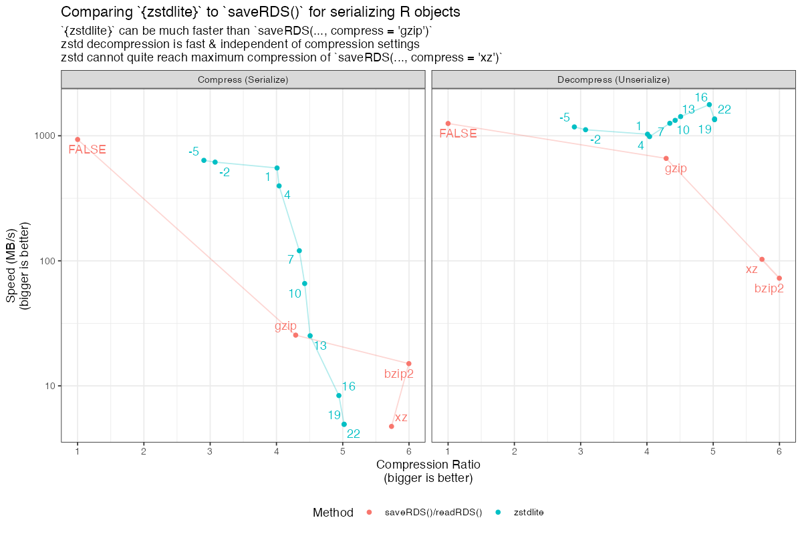

<!-- README.md is generated from README.Rmd. Please edit that file -->

```{r, include = FALSE}
knitr::opts_chunk$set(
  collapse = FALSE,
  comment = "#>",
  fig.path = "man/figures/README-",
  out.width = "100%"
)

library(dplyr)
library(zstdlite)


if (FALSE) {
  covr::report(covr::package_coverage(
    line_exclusions = list('src/zstd.c', 'src/zstd.h')
  ))
}

if (FALSE) {
  pkgdown::build_site(override = list(destination = "../coolbutuseless.github.io/package/yyjsonr"))
}
```

# zstdlite

<!-- badges: start -->

[](https://github.com/coolbutuseless/zstdlite/actions/workflows/R-CMD-check.yaml)
<!-- badges: end -->

`zstdlite` provides access to the very fast (and highly configurable) 
 [zstd](https://github.com/facebook/zstd) library for serialization of
R objects and compression/decompression of raw byte buffers and strings.

[zstd](https://github.com/facebook/zstd) code provided with this package is v1.5.6, 
and is included under its BSD license (compatible with the MIT license for this package).


## What's in the box

* `zstdfile()`
    * A connection object (like `gzfile()` or `url()`) which supports Zstandard 
      compressed data.
    * Supports read/write of both text and binary data.  e.g. `readLines()` and 
      `readBin()`
    * Can be used by any R code which supports connections.
    * Like `gzcon()`, `zstdfile()` can also write to other connections.
        * e.g. `zstdfile(fifo("out"))`
* `zstd_serialize()` and `zstd_unserialize()` 
    * convert arbitrary R objects to/from a compressed representation
    * this is equivalent to base R's `serialize()`/`unserialize()` with the addition
      of `zstd` compression on the serialized data
* `zstd_compress()` and `zstd_decompress()` are for compressing/decompressing strings and raw vectors -
  usually for interfacing with other systems e.g. data was already compressed on the command line.
* `zstd_info()` returns a named list of information about a compressed data source
* `zstd_cctx()` and `zstd_dctx()` initialize compression and 
  decompression contexts, respectively.  Options:
    * `level` compression level in range [-5, 22]. Default: 3
    * `num_threads` number of threads to use. Default: 1
    * `include_checksum`/`validate_checksum` Default: FALSE
    * `dict` specify dictionary for aiding compression
* `zstd_train_dict_compress()` and `zstd_train_dict_serialize()` for creating
  dictionaries which can speed up compression/decompression


## Comparison to `saveRDS()`/`readRDS()`

The image below compares `{zstdlite}` with `saveRDS()` for saving compressed
representations of R objects.  (See `man/benchmarks.R` for code)

Things to note in this comparison for the particular data used:

* `zstd` compression can be much faster than the compression options 
  offered by `saveRDS()`
* `zstd` decompression speed is very fast and (mostly) independent of compression
  settings
* Compressing with `xz` and `bzip2` can both produce more compressed representations but
  at the expense of slow compression/decompression.





## Installation

To install from r-universe:

``` r
install.packages('zstdlite', repos = c('https://coolbutuseless.r-universe.dev', 'https://cloud.r-project.org'))
```

To install latest version from [GitHub](https://github.com/coolbutuseless/zstdlite):

``` r
# install.package('remotes')
remotes::install_github('coolbutuseless/zstdlite')
```

## Basic Usage of `zstd_serialize()` and `zstd_unserialize()`

`zstd_serialize()` and `zstd_unserialize()` are direct analogues of base R's
`serialize()` and `unserialize()`.

Because `zstd_serialize()` and `zstd_unserialize()` use R's serialization 
mechanism, they will save/load (almost) any R object e.g. data.frames, lists, environments, etc

```{r}
compressed_bytes <- zstd_serialize(head(mtcars))
length(compressed_bytes) 
head(compressed_bytes, 100)

zstd_unserialize(compressed_bytes) 
```


## Using a `zstdfile()` connection

Use `zstdfile()` to allow read/write access of compressed data from any R code
or package which supports connections.

```{r}
tmp <- tempfile()
dat <- as.raw(1:255)
writeBin(dat, zstdfile(tmp))
readBin(zstdfile(tmp), raw(), 255)
```


## Using contexts to set compression arguments

The `zstd` algorithm uses *contexts* to control the compression and decompression.
Every time data is compressed/decompressed a context is created.

*Contexts* can be created ahead-of-time, or created on-the-fly.  There can 
be a some speed advantages to creating a *context* ahead of time and reusing
it for multiple compression operations.

The following ways of calling `zstd_serialize()` are equivalent:

```{r eval=FALSE}
zstd_serialize(data1, num_threads = 3, level = 20)
zstd_serialize(data2, num_threads = 3, level = 20)
```

```{r eval=FALSE}
cctx <- zstd_cctx(num_threads = 3, level = 20)
zstd_serialize(data1, cctx = cctx)
zstd_serialize(data2, cctx = cctx)
```


## Using `zstd_compression()`/`zstd_decompress()` for raw data and strings

`zstd_serialize()`/`zstd_unserialize()` compress R objects that are really only 
useful when working in R, or sharing data with other R users.

In contrast, `zstd_compress()`/`zstd_decompress()` operate on raw vectors
and strings, and these functions are suitable 
for handling compressed data which is compatible with other systems and languages

Examples:

* reading compressed JSON files
* writing compressed data for storage in a database that will be accessed 
  by different computer languages and operating systems.


```{r eval=FALSE, echo=FALSE}
zz <- as.list(mtcars[1,]) |> jsonlite::toJSON(pretty = TRUE)
writeLines(zz, "man/figures/data.json")
system("zstd man/figures/data.json")
```

#### Reading a compressed JSON file

JSON files are often compressed.  In this case, the `data.json` file was 
compressed using the `zstd` command-line tool, i.e.

    zstd data.json -o data.json.zst
    
This compressed file can be read directly into R as uncompressed bytes (in a 
raw vector), or as a string

```{r}
#~~~~~~~~~~~~~~~~~~~~~~~~~~~~~~~~~~~~~~~~~~~~~~~~~~~~~~~~~~~~~~~~~~~~~~~~~~~~
# Read a compressed JSON file as raw bytes or as a string
#~~~~~~~~~~~~~~~~~~~~~~~~~~~~~~~~~~~~~~~~~~~~~~~~~~~~~~~~~~~~~~~~~~~~~~~~~~~~
zstd_decompress("man/figures/data.json.zst")
zstd_decompress("man/figures/data.json.zst", type = 'string') |> cat()
```

#### Compressing a string

When transmitting large amounts of text to another system, we may wish to 
first compress it.

The following string (`manifesto`) is compressed by `zstd_compress()` and
can be uncompressed by any system which supports the `zstd` library, or
even just using the `zstd` command-line tool.


```{r}
#~~~~~~~~~~~~~~~~~~~~~~~~~~~~~~~~~~~~~~~~~~~~~~~~~~~~~~~~~~~~~~~~~~~~~~~~~~~~
# Compress a string directly 
#~~~~~~~~~~~~~~~~~~~~~~~~~~~~~~~~~~~~~~~~~~~~~~~~~~~~~~~~~~~~~~~~~~~~~~~~~~~~
manifesto <- paste(lorem::ipsum(paragraphs = 100), collapse = "\n")
lobstr::obj_size(manifesto)

compressed <- zstd_compress(manifesto, level = 22)
lobstr::obj_size(compressed)

identical(
  zstd_decompress(compressed, type = 'string'),
  manifesto
)
```


## Limitations

* Reference objects which need to be serialized with a `refhook` approach are not handled.


## Dictionary-based compression

From the `zstd` documentation:

    Zstd can use dictionaries to improve compression ratio of small data.
    Traditionally small files don't compress well because there is very little
    repetition in a single sample, since it is small. But, if you are compressing
    many similar files, like a bunch of JSON records that share the same
    structure, you can train a dictionary on ahead of time on some samples of
    these files. Then, zstd can use the dictionary to find repetitions that are
    present across samples. This can vastly improve compression ratio.


### Dictionary Example


The following shows that using a dictionary for this specific 
example doubles the compression ratio!

```{r}
set.seed(2024)
countries <- rownames(LifeCycleSavings)

#~~~~~~~~~~~~~~~~~~~~~~~~~~~~~~~~~~~~~~~~~~~~~~~~~~~~~~~~~~~~~~~~~~~~~~~~~~~~
# In this example consider the case of having a named vector of rankings of 
# countries.  Each ranking will be compressed separately and stored (say in a database)
#~~~~~~~~~~~~~~~~~~~~~~~~~~~~~~~~~~~~~~~~~~~~~~~~~~~~~~~~~~~~~~~~~~~~~~~~~~~~
rankings <- lapply(
  1:1000, 
  \(x) setNames(sample(length(countries)), countries)
)

#~~~~~~~~~~~~~~~~~~~~~~~~~~~~~~~~~~~~~~~~~~~~~~~~~~~~~~~~~~~~~~~~~~~~~~~~~~~~
# Create a dictionary
#~~~~~~~~~~~~~~~~~~~~~~~~~~~~~~~~~~~~~~~~~~~~~~~~~~~~~~~~~~~~~~~~~~~~~~~~~~~~
dict <- zstd_train_dict_serialize(rankings, size = 1500, optim = TRUE)

#~~~~~~~~~~~~~~~~~~~~~~~~~~~~~~~~~~~~~~~~~~~~~~~~~~~~~~~~~~~~~~~~~~~~~~~~~~~~
# Setup Compression contexts to use this dictionary
#~~~~~~~~~~~~~~~~~~~~~~~~~~~~~~~~~~~~~~~~~~~~~~~~~~~~~~~~~~~~~~~~~~~~~~~~~~~~
cctx_nodict <- zstd_cctx(level = 13) # No dictionary. For comparison
cctx_dict   <- zstd_cctx(level = 13, dict = dict)

#~~~~~~~~~~~~~~~~~~~~~~~~~~~~~~~~~~~~~~~~~~~~~~~~~~~~~~~~~~~~~~~~~~~~~~~~~~~~
# When using the dictionary, what is the size of the compressed data compared
# to not using a dicionary here?
#~~~~~~~~~~~~~~~~~~~~~~~~~~~~~~~~~~~~~~~~~~~~~~~~~~~~~~~~~~~~~~~~~~~~~~~~~~~~
s1 <- lapply(rankings, \(x) zstd_serialize(x, cctx = cctx_nodict)) |> lengths() |> sum()
s2 <- lapply(rankings, \(x) zstd_serialize(x, cctx = cctx_dict  )) |> lengths() |> sum()
```

```{r echo=FALSE}
s0 <- lapply(rankings, \(x) serialize(x, NULL)) |> lengths() |> sum()
cat("Compression ratio                :", round(s0/s1, 1), "\n")
cat("Compression ratio with dictionary:", round(s0/s2, 1), "\n")
```


## Acknowledgements

* Yann Collett for creating 
[lz4](https://github.com/lz4/lz4) and [zstd](https://github.com/facebook/zstd)
* R Core for developing and maintaining such a wonderful language.
* CRAN maintainers, for patiently shepherding packages onto CRAN and maintaining
  the repository
