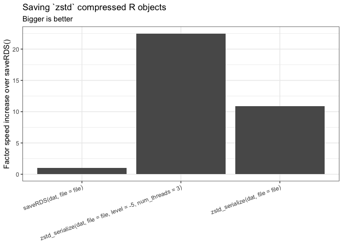

<!-- README.md is generated from README.Rmd. Please edit that file -->

# zstdlite

<!-- badges: start -->

 [](https://www.tidyverse.org/lifecycle/#experimental)
[](https://github.com/coolbutuseless/zstdlite/actions/workflows/R-CMD-check.yaml)
<!-- badges: end -->

`zstdlite` provides access to the very fast (and highly configurable)
[zstd](https://github.com/facebook/zstd) library for performing
in-memory compression of R objects.

[zstd](https://github.com/facebook/zstd) code provided with this package
is v1.5.5.

# ToDo before release

- zstd_compress/zstd_decompess() to file should use a streaming
  interface
- Debug/test compression/decompression with dictionaries

## What’s in the box

- `zstd_serialize()` and `zstd_unserialize()` for converting R objects
  to/from a compressed representation

## Installation

You can install from
[GitHub](https://github.com/coolbutuseless/zstdlite) with:

``` r
# install.package('remotes')
remotes::install_github('coolbutuseless/zstdlite')
```

## Basic Usage

``` r
lobstr::obj_size(mtcars)
```

    #> 7.21 kB

``` r
buf <- zstd_serialize(mtcars)
length(buf) # Number of compressed bytes
```

    #> [1] 1307

``` r
# compression ratio
length(buf)/as.numeric(lobstr::obj_size(mtcars))
```

    #> [1] 0.1813263

``` r
zstd_unserialize(buf) |> head()
```

    #>                    mpg cyl disp  hp drat    wt  qsec vs am gear carb
    #> Mazda RX4         21.0   6  160 110 3.90 2.620 16.46  0  1    4    4
    #> Mazda RX4 Wag     21.0   6  160 110 3.90 2.875 17.02  0  1    4    4
    #> Datsun 710        22.8   4  108  93 3.85 2.320 18.61  1  1    4    1
    #> Hornet 4 Drive    21.4   6  258 110 3.08 3.215 19.44  1  0    3    1
    #> Hornet Sportabout 18.7   8  360 175 3.15 3.440 17.02  0  0    3    2
    #> Valiant           18.1   6  225 105 2.76 3.460 20.22  1  0    3    1

## Simple Benchmark

``` r
dat <- iris[sample(nrow(iris), 100000, TRUE),]
lobstr::obj_size(dat)
```

    #> 10.00 MB

``` r
file <- tempfile()
res <- bench::mark(
  zstd_serialize(dat, file = file),
  zstd_serialize(dat, file = file, level = -5, num_threads = 3),
  saveRDS(dat, file = file)
)

res[,1:5]
```

    #> # A tibble: 3 × 5
    #>   expression                                    min   median `itr/sec` mem_alloc
    #>   <bch:expr>                               <bch:tm> <bch:tm>     <dbl> <bch:byt>
    #> 1 zstd_serialize(dat, file = file)          15.16ms   15.3ms     65.0    17.27KB
    #> 2 zstd_serialize(dat, file = file, level …   7.09ms   7.32ms    137.     17.27KB
    #> 3 saveRDS(dat, file = file)                 163.7ms 164.16ms      6.09    8.63KB



### Zstd “Single File” Libary

- To simplify the code within this package, it uses the ‘single file
  library’ version of zstd
- To update this package when zstd is updated, create the single file
  library version
  1.  cd zstd/build/single_file_libs
  2.  sh create_single_file_library.sh
  3.  Wait…..
  4.  copy zstd/built/single_file_libs/zstd.c into zstdlite/src
  5.  copy zstd/lib/zstd.h into zstdlite/src

## Related Software

For a more general solution to fast serialization of R objects, see the
[fst](https://github.com/fstpackage/fst) or
[qs](https://cran.r-project.org/package=qs) packages.

- [lz4](https://github.com/lz4/lz4) and
  [zstd](https://github.com/facebook/zstd) - both by Yann Collet
- [fst](https://github.com/fstpackage/fst) for serialisation of
  data.frames using lz4 and zstd
- [qs](https://cran.r-project.org/package=qs) for fast serialization of
  arbitrary R objects with lz4 and zstd

## Acknowledgements

- Yann Collett for releasing, maintaining and advancing
  [lz4](https://github.com/lz4/lz4) and
  [zstd](https://github.com/facebook/zstd)
- R Core for developing and maintaining such a wonderful language.
- CRAN maintainers, for patiently shepherding packages onto CRAN and
  maintaining the repository
